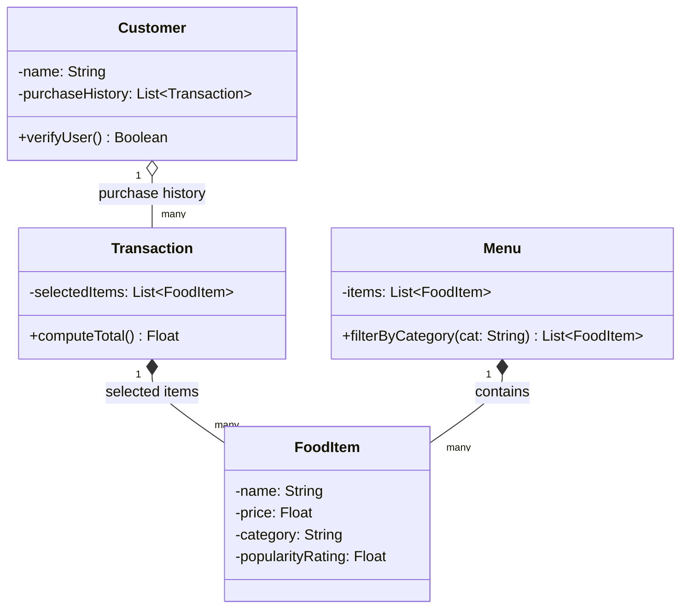

# ByteBites UML Class Diagram

```mermaid
classDiagram
    class Customer {
        -name: String
        -purchaseHistory: List~Transaction~
        +verifyUser() Boolean
    }

    class Transaction {
        -selectedItems: List~FoodItem~
        +computeTotal() Float
    }

    class FoodItem {
        -name: String
        -price: Float
        -category: String
        -popularityRating: Float
    }

    class Menu {
        -items: List~FoodItem~
        +filterByCategory(cat: String) List~FoodItem~
    }

    Customer "1" o-- "many" Transaction : purchase history
    Transaction "1" *-- "many" FoodItem : selected items
    Menu "1" *-- "many" FoodItem : contains
```
